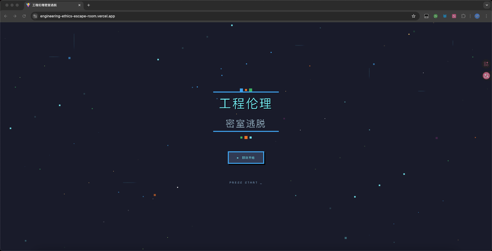
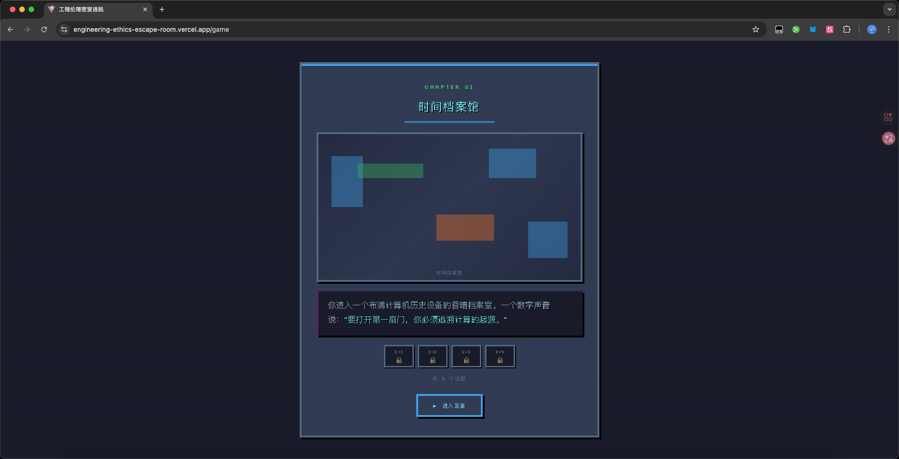
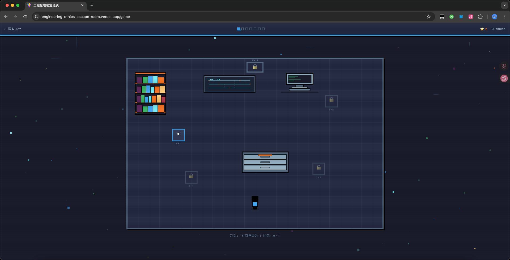
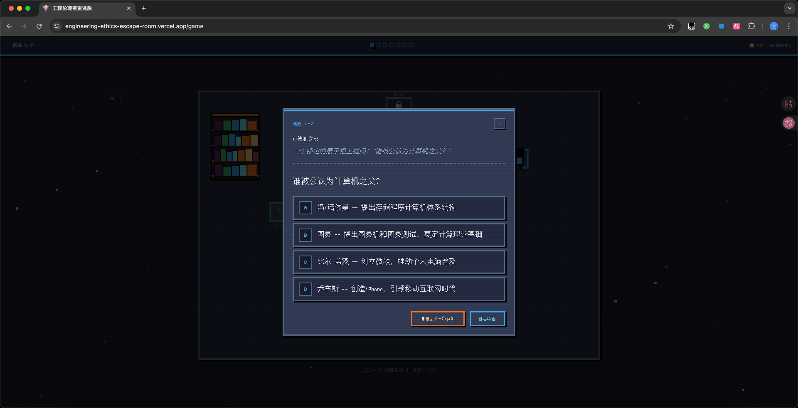
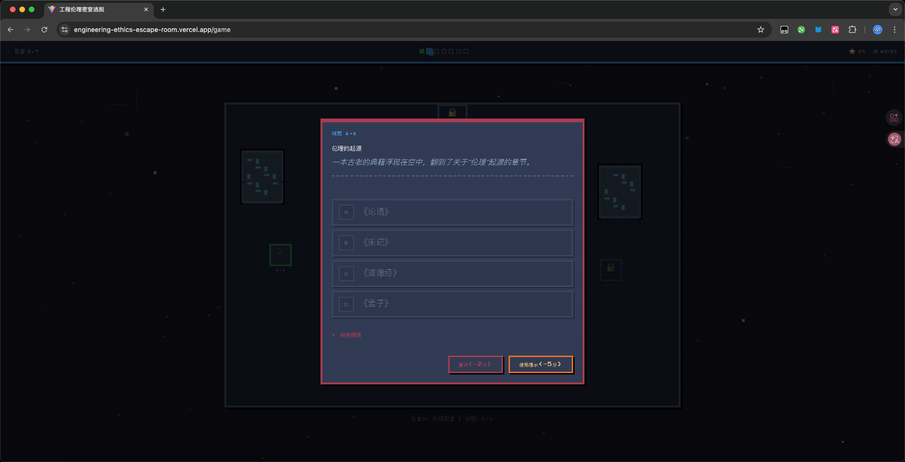
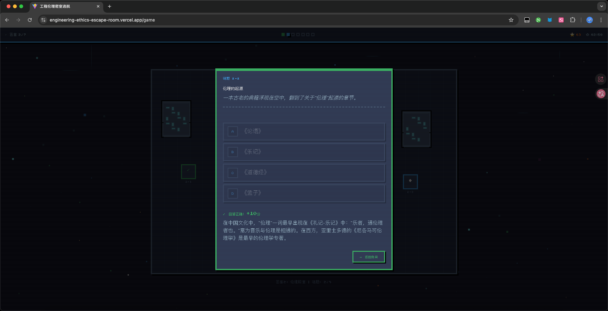
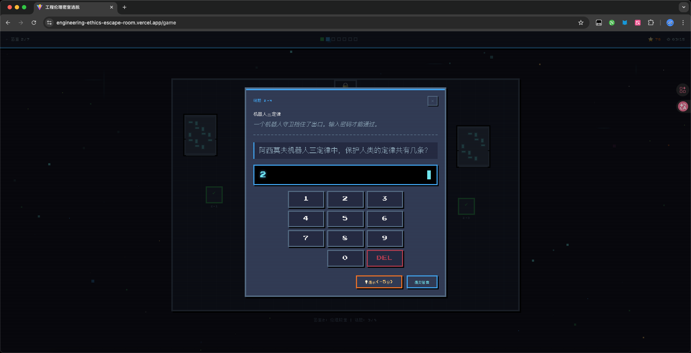
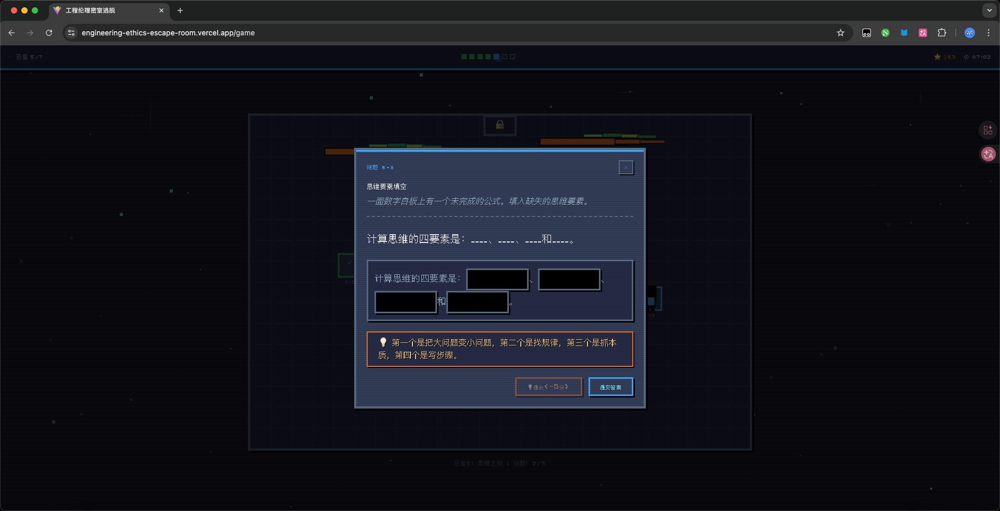
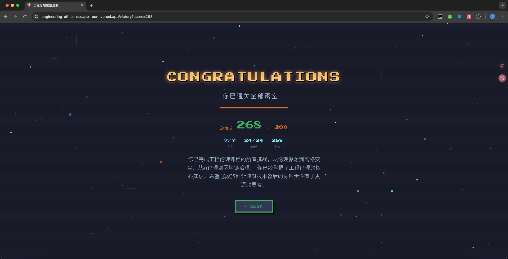

# 工程伦理密室逃脱 — 说明文档

## 一、相关知识点简介

本作品为《工程伦理》课程配套的教育游戏，以密室逃脱的形式涵盖7个章节、24道谜题，将课程知识点融入互动解谜过程。

### 章节与知识点

| 章节 | 密室名称 | 核心知识点 |
|------|----------|------------|
| 第1章 · 计算机发展 | 时间档案馆 | 图灵与冯·诺依曼的贡献、计算机发展时间线（1936-2022）、大数据3V特征、数据单位排序 |
| 第2章 · 伦理基础 | 伦理殿堂 | 伦理/道德/法律辨析、伦理的中国起源（《礼记·乐记》）、工程伦理案例识别、阿西莫夫机器人三定律 |
| 第3章 · 职业素养 | 职业竞技场 | 新人困境分类（技能/人际/合作）、职业素养判断、职业素养核心构成要素 |
| 第4章 · 工匠精神 | 大师工坊 | 工匠精神案例识别（王震华、慎独精神）、CDIO工程教育四阶段（构思→设计→实现→运作） |
| 第5章 · 计算教育 | 思维之树 | 计算思维四要素（分解、模式识别、抽象、算法设计）、计算之树结构 |
| 第6章 · 信息安全 | 安全金库 | CIA三要素（机密性/完整性/可用性）、网络威胁分类（钓鱼/勒索/社会工程学/DDoS）、《个人信息保护法》、开源许可证分类 |
| 第7章 · 区块链 | 区块链节点 | 区块链发展时间线、The DAO重入攻击事件、区块链伦理（GDPR冲突/代码即法律/能耗）、区块链信息服务备案 |

### 谜题交互类型

游戏包含6种交互类型，全面覆盖不同的认知层次：

1. **点击排序**（drag-sort）— 点击选中一个项目，再点击另一个项目交换位置，逐步排成正确顺序
2. **点击分类**（drag-classify）— 点击选中一个条目，再点击对应类别将其归入
3. **单选/多选题**（multiple-choice）— 选择正确答案
4. **情景判断**（scenario）— 判断真实场景中的伦理对错
5. **密码锁**（password-lock）— 根据线索输入答案
6. **填空题**（fill-blank）— 填入关键概念

---

## 二、使用的AI工具

| 工具 | 用途 |
|------|------|
| **GLM（智谱AI）** | AI 对话辅助 — 代码生成与审查、架构设计建议、像素风素材搜索与推荐、样式系统迁移方案 |
| **Claude Code（Anthropic）** | 终端级 AI 编程助手 — 项目初始化、文件编辑、并行 agent 调度（3个 agent 并行绘制像素风装饰物）、自动化脚本执行、调试修复 |

### AI 辅助开发具体场景

- **架构设计**：使用 GLM 辅助设计 React + TypeScript 项目结构，定义 discriminated union 类型系统；Claude Code 负责具体文件操作与代码编写
- **像素风装饰物绘制**：通过 Claude Code 的并行 agent 功能，同时派发3个 agent 分别绘制 furniture、screen、equipment 三类装饰物
- **样式系统迁移**：GLM 提供从暗色科幻风格切换到像素复古风的方案，Claude Code 执行设计令牌、动画、字体、配色的全面替换
- **布局检测**：Claude Code 编写自动化脚本检测7个房间中装饰物与谜题点的重叠问题并批量修复
- **素材搜索**：GLM 全网搜索像素风游戏素材（背景、角色、装饰物、音效），整理下载链接供选择

---

## 三、关键词

`工程伦理` `密室逃脱` `教育游戏` `像素复古风` `React 19` `TypeScript 5.9` `Vite 7` `Tailwind CSS 4` `react-konva` `Canvas 渲染` `点击交互` `情景判断` `状态管理` `像素艺术` `8-bit 风格` `AI 辅助开发` `迭代开发`

### 典型 AI 提示词

以下是开发过程中使用的典型提示词，反映了 AI 辅助开发的实际工作模式：

**1. 文档驱动开发**

> "帮我制定游戏设计文档、风格指南以及页面布局设计三个文档，涵盖7个密室房间、24道谜题、6种交互类型"

> "根据设计文档拆分出开发步骤，每个步骤要独立可验证，出问题时能及时修正"

**2. 知识点格式化**

> "将以下课堂知识点整理成题库，格式化为 TypeScript 类型，每道题包含题目、选项、正确答案、解析和提示"

**3. 迭代开发与问题修正**

> "角色移动时点击位置和实际到达位置不匹配，排查发现人物站位坐标按左上角计算，但鼠标点击按中心点计算，请统一为中心点锚点"

**4. 性能优化**

> "背景装饰元素目前用 HTML DOM 渲染，粒子数量多时性能差，改为 Canvas 方案渲染"

**5. 并行开发**

> "给每个 decor type 在 canvas 绘制一些像素风样式，不同的类型使用多个 subagent 并行绘制"

**6. 布局检测**

> "检查 rooms.ts，我希望每个房间的 layout 不要有重叠的情况"

---

## 四、制作步骤

### 开发方法论：文档驱动 + 迭代开发

由于 AI 无法一次性完成整个项目，采用**文档先行、分步迭代**的开发方式：

1. 首先由 AI 生成**游戏设计文档**、**风格指南**、**页面布局设计**三份核心文档
2. 个人审查文档内容，确认游戏机制、视觉风格、页面结构
3. 将文档拆分为多个独立的开发步骤，每步完成后验证再进入下一步
4. 出现问题时在当前步骤及时修正，避免错误累积到后续步骤

### 第1步：设计文档制定

- 使用 GLM 生成《游戏设计文档》，涵盖7个密室房间的主题、24道谜题的题目与答案、评分规则、成就系统
- 使用 GLM 生成《风格指南》，定义像素复古视觉风格：调色板、字体、动画规范、组件样式
- 使用 GLM 生成《页面布局设计》，以 ASCII 图描述每个页面的布局与页面间的跳转关系
- **人工审查**：通读三份文档，修正不合理的设计，确认技术可行性

### 第2步：项目初始化

- 使用 Vite 创建 React + TypeScript 项目模板
- 配置 Tailwind CSS 4、ESLint、lint-staged、simple-git-hooks
- 定义设计系统：像素字体（Press Start 2P / VT323 / Silkscreen）、复古8-bit调色板、像素风动画

### 第3步：数据建模与题库制作

- 在 `src/types/game.ts` 中定义 TypeScript 类型系统：6种谜题类型的 discriminated union、房间布局、游戏状态
- 将课堂知识点（20份课程资料）整理为原始题库
- 使用 AI 将题库格式化为 TypeScript 数据结构，每道题包含：题目、选项、正确答案、知识点、解析、提示
- 在 `src/data/puzzles/room1-7.ts` 中存放全部24道谜题数据
- 在 `src/data/rooms.ts` 中定义7个房间的布局（谜题点位置、装饰物、入口/出口坐标）
- 在 `src/data/achievements.ts` 中定义10个成就

### 第4步：页面路由与视图层

- 使用 React Router 7 配置路由：`/`（开始页）、`/game`（游戏页）、`/victory`（胜利页）
- 实现 StartScreen（开始画面，含动态像素粒子背景）、GameScreen（游戏主界面）、VictoryScreen（通关画面）

### 第5步：房间场景渲染

- 使用 react-konva（Canvas）实现2D俯视角房间场景
- 实现网格背景、答题点（PuzzlePoint）、出口门（ExitDoor）、像素风角色（CharacterSprite）
- 角色支持点击移动、行走动画、方向切换、错误闪烁、分数弹出

### 第6步：像素风装饰物绘制

- 创建 `src/components/room/decors/` 目录，按类型分离绘制组件
- 通过 Claude Code 并行 agent 功能同时绘制三类装饰物：
  - **FurnitureDecor**：书架、档案柜、祭坛、办公桌、工作台、保险箱（共6种）
  - **ScreenDecor**：时间线屏幕、石碑、蓝图、数据节点、法律文件、区块链连接、显示器（共7种）
  - **EquipmentDecor**：CRT古董电脑、天平、漂浮简历、桥梁模型、工具箱、树干/树枝、指纹扫描仪、全息锁、3D区块（共10种）
- 通过 DecorRenderer 统一路由，根据 `decor.type` 分发到对应绘制组件

### 第7步：谜题交互组件

- 实现6种谜题交互组件：DragSortPuzzle、DragClassifyPuzzle、MultipleChoicePuzzle、ScenarioPuzzle、PasswordLockPuzzle、FillBlankPuzzle
- 排序采用点击交换（选中两项交换位置），分类采用点击归入（选中条目后点击类别）
- 统一使用 PuzzleShell 外壳组件，提供标题、叙事文本、提交/提示按钮

### 第8步：游戏状态与逻辑

- 使用 React Context + useReducer 管理全局游戏状态（GameState / GameAction）
- 实现房间探索流程：进入 → 探索 → 解谜 → 通关
- 实现计分、提示使用、成就解锁、计时等功能

### 第9步：视觉风格迭代

- 从暗色科幻霓虹风格迁移到像素复古风格
- 更新 CSS 设计令牌：字体、配色、动画、按钮、卡片
- 添加动态背景效果：闪烁星星、上浮像素块、像素雨、电路脉冲线
- 运行布局重叠检测脚本并修复所有16个重叠问题

### 第10步：测试与优化

- TypeScript 类型检查通过
- ESLint 代码规范检查
- 响应式适配（max-width 100%）
- Canvas 性能优化（image-rendering: pixelated）

### 开发中遇到的问题与解决

#### 问题1：角色移动位置偏移

**现象**：点击场景中的某个位置，角色移动到达的终点与鼠标点击位置不一致。

**排查**：经检查发现，谜题点的 `standX/standY`（角色站位坐标）按左上角锚点计算，而鼠标点击事件按中心点锚点计算，两者坐标体系不统一。

**解决**：统一所有交互元素（角色、答题点、出口门）为中心点锚点（通过 Konva 的 `offsetX/offsetY` 设为元素尺寸的一半），确保点击位置与移动目标位置一致。

#### 问题2：DOM 渲染性能差

**现象**：开始页面的动态背景装饰（星星、像素块等）使用 HTML DOM 元素渲染，粒子数量增多后页面出现明显卡顿。

**原因**：大量 DOM 元素触发频繁的浏览器重排（reflow），导致性能下降。

**解决**：将动态背景从 HTML DOM 方案改为 Canvas 渲染方案（使用 Konva.js），所有粒子在 Canvas 层绘制，脱离 DOM 树，性能显著提升。

#### 问题3：答题正确后答案状态丢失

**现象**：玩家回答正确后，模态框中的选中状态、填写内容、排列顺序全部消失，显示为空白初始状态。

**排查过程**：

第一步，检查谜题组件的 `disabled` 逻辑。发现答对后 `disabled={true}` 导致 `opacity: 0.5`，答案看不清。添加了 `correct` prop 区分答对和答错：答对时 `opacity: 1`（满透明度），答错时 `opacity: 0.5`。

第二步，排序题答对后仍不显示正确顺序。使用 AI 辅助排查，提示词：

> "目前回答正确之后还是没有按照顺序显示，或许是生命周期或者其他问题"

第三步，定位根因。阅读 `PuzzleShell.tsx` 第277行发现 `<Wrapper $resultState={resultState} key={resultState}>`。当 `resultState` 从 `'none'` 变成 `'correct'` 时，React 因 key 变化**卸载旧组件并重新挂载新组件**。所有谜题组件的 `useState` 用初始值重新初始化，用户的选择状态全部丢失。

**根因**：`PuzzleShell` 的 `key={resultState}` 导致子组件在答案状态变化时完全重新挂载，`useState` 被重置为初始值。

**解决**：在每个谜题组件中添加 `useEffect`，监听 `correct` prop。组件因 key 变化重新挂载时，`correct=true` 会立即将状态设为正确答案：

```tsx
// DragSortPuzzle — 恢复正确排序
useEffect(() => {
  if (correct) {
    setCurrentOrder([...data.correctOrder])
  }
}, [correct, data.correctOrder])

// DragClassifyPuzzle — 恢复正确分类
useEffect(() => {
  if (correct) {
    const correctAssignments = {}
    for (const item of data.items) {
      correctAssignments[item.text] = item.category
    }
    setAssignments(correctAssignments)
  }
}, [correct, data.items])

// MultipleChoicePuzzle / ScenarioPuzzle — 恢复正确选项
useEffect(() => {
  if (correct) {
    const correctLabels = data.options.filter(o => o.correct).map(o => o.label)
    setSelectedLabels(new Set(correctLabels))
  }
}, [correct, data.options])

// PasswordLockPuzzle — 恢复正确答案
useEffect(() => {
  if (correct) {
    setInput(String(data.answer))
  }
}, [correct, data.answer])

// FillBlankPuzzle — 恢复正确填空
useEffect(() => {
  if (correct) {
    setValues([...data.blanks])
  }
}, [correct, data.blanks])
```

通过 Claude Code 的并行 agent 功能，同时派发5个 agent 修复5个谜题组件，全部修复后 TypeScript 编译零错误通过。

**典型提示词**：

> "目前需要修改一个问题，在回答正确的时候，我需要模态框保留回答正确时的选中状态，填写状态，顺序状态等状态，需要保留答案在模态框上面"

> "如果是排序题，在回答正确的状态下，我需要顺序按照正确顺序显示"

> "开多个subagent，将剩余的puzzle组件在回答正确的状态下显示正确答案"

---

## 五、其它

### 技术栈

| 层级 | 技术 | 版本 |
|------|------|------|
| 框架 | React | 19.2 |
| 语言 | TypeScript | 5.9 |
| 构建 | Vite | 7.2 |
| 样式 | Tailwind CSS + styled-components | 4.2 / 6.4 |
| Canvas | react-konva (Konva.js) | 19.2 / 10.2 |
| 路由 | React Router | 7.14 |
| 动画 | Motion (Framer Motion) | 12.38 |
| 代码规范 | ESLint + lint-staged + simple-git-hooks | — |

### 项目结构

```
src/
├── App.tsx                    # 路由入口
├── index.css                  # 全局设计系统（Tailwind 令牌、动画、工具类）
├── types/game.ts              # TypeScript 类型定义
├── data/
│   ├── puzzles/room1-7.ts     # 7个房间的谜题数据
│   ├── rooms.ts               # 房间布局与元数据
│   └── achievements.ts        # 成就定义
├── views/
│   ├── StartScreen.tsx        # 开始页面
│   ├── GameScreen.tsx         # 游戏主页面
│   └── VictoryScreen.tsx      # 胜利页面
└── components/
    ├── room/
    │   ├── RoomScene.tsx      # Konva 房间场景
    │   ├── PuzzlePoint.tsx    # 答题点
    │   ├── ExitDoor.tsx       # 出口门
    │   ├── RoomEntrance.tsx   # 房间入口动画
    │   └── decors/
    │       ├── index.tsx           # 装饰物渲染路由
    │       ├── FurnitureDecor.tsx  # 家具类（6种）
    │       ├── ScreenDecor.tsx     # 屏幕类（7种）
    │       └── EquipmentDecor.tsx  # 设备类（10种）
    ├── character/
    │   └── CharacterSprite.tsx # 像素角色
    ├── puzzle/                 # 6种谜题交互组件
    │   ├── PuzzleShell.tsx
    │   ├── DragSortPuzzle.tsx
    │   ├── DragClassifyPuzzle.tsx
    │   ├── MultipleChoicePuzzle.tsx
    │   ├── ScenarioPuzzle.tsx
    │   ├── FillBlankPuzzle.tsx
    │   └── PasswordLockPuzzle.tsx
    └── effects/
        └── PixelBackground.tsx # 像素动态背景
```

### 设计理念

- **寓教于乐**：将工程伦理知识点融入密室逃脱的游戏机制，通过解谜驱动学习
- **像素复古美学**：8-bit 像素风格契合计算机/工程主题，降低美术素材门槛
- **Canvas 高性能渲染**：使用 Konva.js 在 Canvas 层渲染房间场景，保证流畅的交互体验
- **数据驱动架构**：谜题内容与组件完全解耦，便于后续扩展和内容更新

### 项目地址

- **在线体验**：[https://engineering-ethics-escape-room.vercel.app/](https://engineering-ethics-escape-room.vercel.app/)
- **GitHub 仓库**：[https://github.com/PZRvm/engineering-ethics-escape-room](https://github.com/PZRvm/engineering-ethics-escape-room)

### 本地运行

```bash
git clone https://github.com/PZRvm/engineering-ethics-escape-room.git
cd engineering-ethics-escape-room
npm install      # 安装依赖
npm run dev      # 启动开发服务器
npm run build    # 生产构建
npm run preview  # 预览构建结果
```

### 游戏截图

**首页** — 深色背景显示"工程伦理"和"密室逃脱"标题，像素风粒子装饰和蓝色边框装饰块，底部"即将开始"按钮



**章节进入** — 显示当前章节"CHAPTER 01 时间档案馆"，谜题进度和进入密室按钮



**房间探索** — 像素风俯视2D场景，书架、电脑显示器、抽屉等互动物品，顶部计时器和进度，底部谜题完成进度



**答题界面** — 谜题1-2"计算机之父"，四个选项（冯·诺依曼、图灵、比尔·盖茨、乔布斯），底部提示和提交按钮



**回答错误** — 谜题2-2"伦理的起源"回答错误反馈，红色"重试(-2分)"和橙色"使用提示(-5分)"按钮



**回答正确** — 绿色勾号和"回答正确! +10分"提示，附正确答案解析，底部"返回房间"按钮



**密码输入** — 谜题2-4阿西莫夫机器人三定律，数字键盘输入界面，根据线索输入正确数字



**填空题** — 谜题5-3计算思维四要素，橙色边框提示框提供解题线索，使用提示扣5分



**游戏通关** — 星空背景胜利页面，得分统计（分数/密室数/谜题数）和工程伦理学习总结，底部"返回首页"按钮


